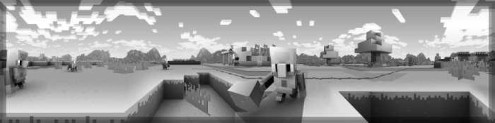
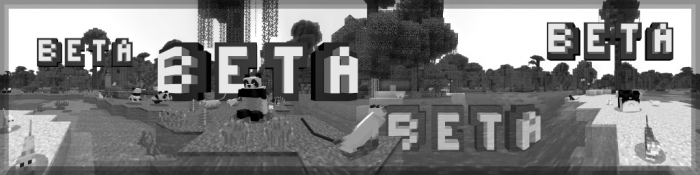
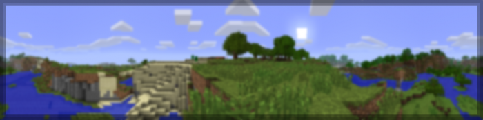
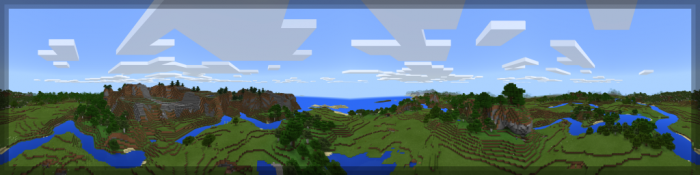
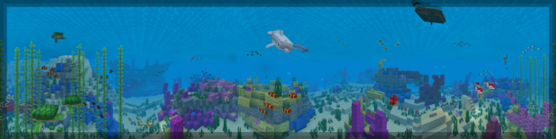
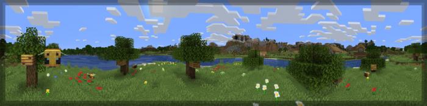
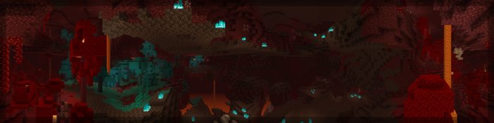
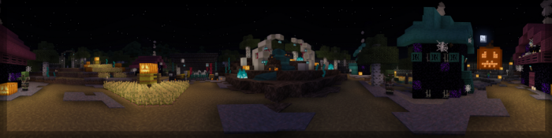

## PanoramaSwitcher 1.00
#### Panorama Switcher is a resource pack made for those interested in revisiting the older panoramas of Minecraft Bedrock, and even of other versions of Minecraft. We've done our absolute best to archive every panorama which was available in Bedrock, including the Halloween panorama from 2021! Panorama Switcher is possibly one of the first to feature it; and isn't it just so cool?
### Media Notice
#### All image media used in this resource pack is property of Mojang AB, and on this page has been downscaled to be able to load faster for slower internet connections. In the game, all panoramas will be their original quality with no compromises.
### Bonus Functionality
#### **COMING SOON** Bonus Functionality will be coming in a future update.
### Included Panoramas

<i class="material-icons">insert_drive_file</i><a href="./upload/PanoramaSwitcher.mcpack" style="font-family: Mojangles">PanoramaSwitcher.mcpack</a>

<i class="material-icons">insert_drive_file</i><a href="./upload/PanoramaSwitcher.zip" style="font-family: Mojangles">PanoramaSwitcher.zip</a>

<element>
<a href="/"><i class="material-icons navigate">first_page</i></a><a href="../"><i class="material-icons navigate">arrow_back</i></a>
</element>
<head></head>
