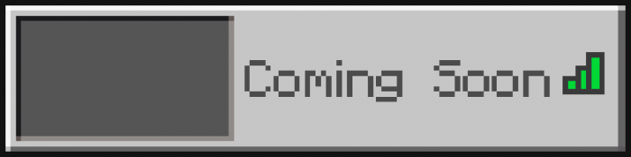
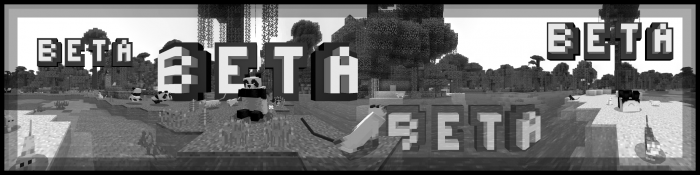
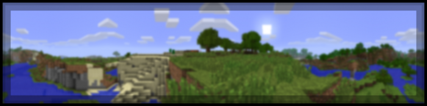
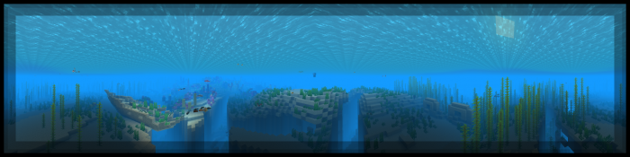
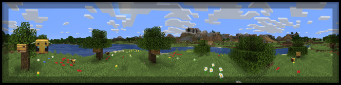

## PanoramaSwitcher 1.01
#### Panorama Switcher is a resource pack made for those interested in revisiting the older panoramas of Minecraft Bedrock, and even of other versions of Minecraft. We've done our absolute best to archive every panorama which was available in Bedrock, including the Halloween panorama from 2021! Panorama Switcher is possibly one of the first to feature it; and isn't it just so cool?
### Extra Functions
#### Since I'm not even close to being finished with all of the planned extra functionality, for now here's a little sneak peak into what's being worked on, though there is no confirmation that the old servers tab is going to be able to return in it's original form; although I'll try to keep it as close as possible.

### Included Panoramas

### Smaller Filesize
#### If you think a pack being over 80mb is a bit ridiculous, know that this is due to all panoramas being high resolution, but if you want to decrease the filesize with the compromise of panorama quality, consider downloading PanoramaSelectorSD, which is less than half the size of the base pack. Alternatively, I'll soon be splitting the pack by platform, which should reduce the filesize as well.

<i class="material-icons">insert_drive_file</i><a href="./upload/PanoramaSwitcher.mcpack" style="font-family: Mojangles">PanoramaSwitcher.mcpack</a>

<i class="material-icons">insert_drive_file</i><a href="./upload/PanoramaSwitcher.zip" style="font-family: Mojangles">PanoramaSwitcher.zip</a>

<i class="material-icons">insert_drive_file</i><a href="./upload/PanoramaSwitcherSD.mcpack" style="font-family: Mojangles">PanoramaSwitcherSD.mcpack</a>

<i class="material-icons">insert_drive_file</i><a href="./upload/PanoramaSwitcherSD.zip" style="font-family: Mojangles">PanoramaSwitcherSD.zip</a>

> ### Changelog
> #### **PanoramaSwitcherSD** - A low-resolution pack with the same purpose as the main pack. All panorama textures have been resized to a size about 512.
> #### **Java Edition Panoramas** - Added 'Aquatic' and 'Village And Pillage' panoramas from Java Edition.
> #### **Education Edition Panoramas** - Added '1.12' panorama from Education Edition.
> #### **Global Panoramas (Java&Bedrock)** - Added 'Caves And Cliffs: Part II' panorama from Minecraft; though since it's in a beta/snapshot version of Minecraft, it is subject to change before 1.18 is released.
> #### **Overall Changes** - I've made some changes to the way that the subpacks are labeled, now showing the platform in which they originated on.

[Root](/), [Previous](../)
<head></head>

