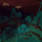

## Mojangson Backup

<a>Cunning Lingus</a>

<a>My anarchy nbts that I made :)</a><a>Have 9 kits and 2 cbe</a>

<i class="material-icons">downloading</i><a href="./upload/743403113787949147/759682959703277588">My_Anarchy_Kits_and_some_nbt.zip</a>

<a>TheBlueShadow</a>

<a>Me, Dank platinum, and dr5hapes did this in our nbt discord, can someone test this? (Respond in #mojangson-discussion of course)</a>

<i class="material-icons">downloading</i><a href="./upload/635652526292729868/759380564679196682.01.txt">759380564679196682.01.txt</a>
<a>[{ActorIdentifier:"minecraft:falling_block&lt;&gt;",SaveData:{IsGlobal:0b,IsPregnant:0b,LootDropped:0b,ShowBottom:0b,Mainhand:[{Count:0b,Damage:0s,Name:""}],IsTrusting:0b,LastDimensionId:0,PortalCooldown:0,IsScared:0b,IsStunned:0b,Color2:0b,Rotation:[143.4375f,0.0f],AttackTime:0s,FallDistance:1.0f,OwnerNew:-1l,TradeTier:0,Chested:0b,Surface:0b,SpawnedByNight:0b,Offhand:[{Count:0b,Damage:0s,Name:""}],IsSwimming:0b,IsIllagerCaptain:0b,Sitting:0b,Pos:[-68.653145f,70.0f,-73.70857f],boundZ:0,Fire:0s,SkinID:0,boundY:0,UniqueID:-21474836400l,Saddled:0b,BodyRot:143.4375f,HurtTime:0s,StrengthMax:0,FallingBlock:{name:"minecraft:command_block",states:{},version:17760256},MarkVariant:0,Strength:0,Sheared:0b,limitedLife:-1,TradeExperience:0,IsGliding:0b,Variant:0,Armor:[{Count:0b,Damage:0s,Name:""},{Count:0b,Damage:0s,Name:""},{Count:0b,Damage:0s,Name:""},{Count:0b,Damage:0s,Name:""}],IsTamed:0b,hasBoundOrigin:0b,IsAngry:0b,IsOrphaned:0b,DeathTime:0s,Attributes:[{Current:16.0f,Max:2048.0f,Base:16.0f,Name:"minecraft:follow_range"},{Current:0.0f,Max:1024.0f,Base:0.0f,Name:"minecraft:luck"},{Current:0.02f,Max:3.4028235E38f,Base:0.02f,Name:"minecraft:underwater_movement"},{Current:0.35f,Max:3.4028235E38f,Base:0.35f,Name:"minecraft:movement"},{Current:0.0f,Max:1.0f,Base:0.0f,Name:"minecraft:knockback_resistance"},{Current:0.0f,Max:16.0f,Base:0.0f,Name:"minecraft:absorption"},{Current:20.0f,Max:20.0f,Base:20.0f,Name:"minecraft:health"}],IsEating:0b,TargetID:-1l,OnGround:1b,Dead:0b,Color:0b,IsBaby:0b,IsRoaring:0b,definitions:["+minecraft:falling_block"],boundX:0,LeasherID:-1l,identifier:"minecraft:falling_block",IsAutonomous:0b,NaturalSpawn:0b,Invulnerable:0b},TicksLeftToStay:1}]</a>

