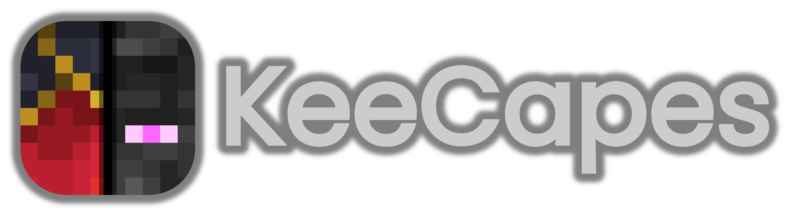
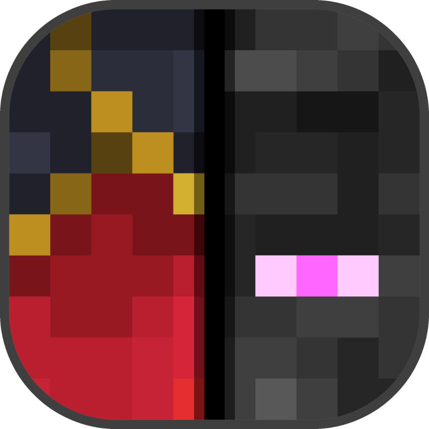

## KeeCapes (Mar 25th, 2022)

<a class="home-content-container" style="border-radius:8px;background: #222d;padding:8px;color:#ccc;display:inline-block;margin:4px;line-height: 24px;text-decoration: none;" href="./upload/KeeCapes.mcpack">
KeeCapes.mcpack

112 KB
</a><a class="home-content-container" style="border-radius:8px;background: #222d;padding:8px;color:#ccc;display:inline-block;margin:4px;line-height: 24px;text-decoration: none;" href="./upload/KeeCapes.zip">
KeeCapes.zip

113 KB
</a>

<h4 style="margin-bottom: 4px;">KeeCapes is a skin pack made for Minecraft with the intention to give players a library of capes that won’t be too large in size. KeeCapes only includes official capes and very few unofficial capes, meaning all included capes are high in quality.
</h4><i class="material-icons">text_snippet</i><h3 id="changelog">Changelog</h3><h4>No Data.</h4><i class="material-icons" style="margin-top: 8px;">image</i><h3 id="changelog" style="margin-top: 8px;">Capes</h3>
