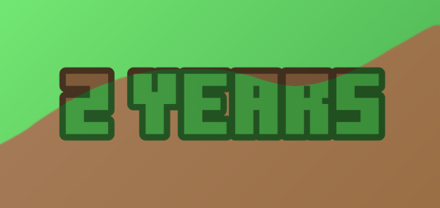

## KeeCapes

<i class="material-icons">update</i><h3>Blog Posts</h3><i class="material-icons"></i>

<a class="home-content-container" style="border-radius:8px;background: #222d;padding:8px;color:#ccc;display:inline-block;margin:4px;line-height: 24px;text-decoration: none;" href="/updates/keecapes-database-restructuring-nov1522">
KeeCapes Database Restructuring

November 15th, 2022
</a>

<a class="home-content-image" href="./200">
2.00
</a><a class="home-content-image" href="./03252022">
Mar 25th, 2022
</a>

