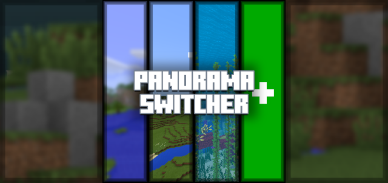
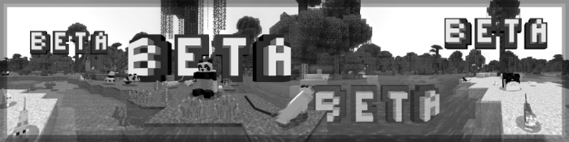
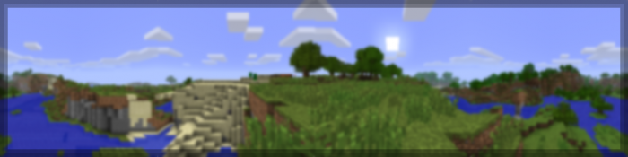
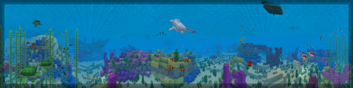
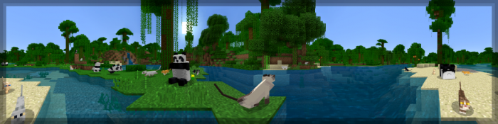
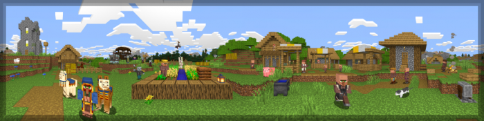
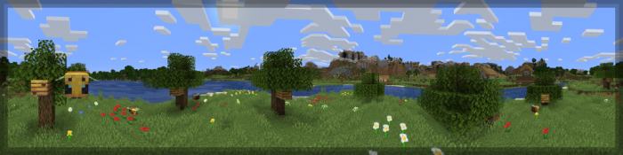
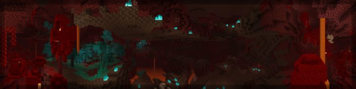
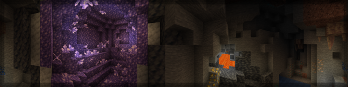
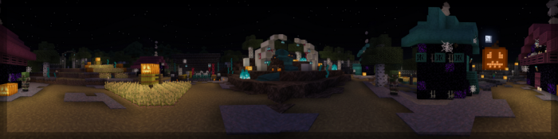

## PanoramaSwitcher

PanoramaSwitcher Version 1.00

<h4 style="margin-bottom:4px">Panorama Switcher is a resource pack made for those interested in revisiting the older panoramas of Minecraft Bedrock, and even of other versions of Minecraft. We've done our absolute best to archive every panorama which was available in Bedrock, including the Halloween panorama from 2021! Panorama Switcher is possibly one of the first to feature it; and isn't it just so cool?</h4>

<i class="material-icons"></i><h3 id="panoramas">Panoramas</h3><i class="material-icons"></i>

<i class="material-icons"></i><h3 id="files">Files</h3><a href="https://github.com/Kee7702/Projects-Legacy/releases/download/779b47a1fce0c/PanoramaSwitcher.mcpack"><h4>PanoramaSwitcher.mcpack (41.7 MB)</h4></a><a href="https://github.com/Kee7702/Projects-Legacy/releases/download/779b47a1fce0c/PanoramaSwitcher.zip"><h4>PanoramaSwitcher.zip (41.7 MB)</h4></a>
<h4 timestamp="2022-10-30T11:59:59.000000Z">Updated: October 30th, 2022 at 11:59:59 GMT</h4>
