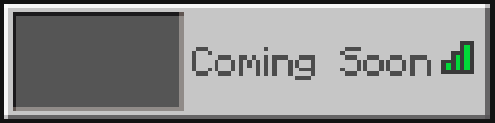
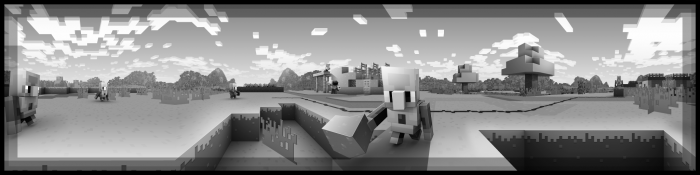

## PanoramaSwitcher

<h4 style="margin:0">Panorama Switcher Version 1.01</h4>
<h4 style="margin-bottom:4px">Panorama Switcher is a resource pack made for those interested in revisiting the older panoramas of Minecraft Bedrock, and even of other versions of Minecraft. I’ve done my absolute best to gather every panorama which was available in Bedrock, and now I’ve decided to share it with all of you!
</h4>

<i class="material-icons">extension</i><h3 id="extra-functions">Extra Functions</h3><i class="material-icons"></i>

<h4>Since I'm not even close to being finished with all of the planned extra functionality, for now here's a little sneak peak into what's being worked on, though there is no confirmation that the old servers tab is going to be able to return in it's original form; although I'll try to keep it as close as possible.</h4>

<i class="material-icons">panorama</i><h3 id="panoramas">Panoramas</h3><i class="material-icons"></i>

<i class="material-icons">text_snippet</i><h3 id="changelog">Changelog</h3><h4>PanoramaSwitcherSD - A low-resolution pack with the same purpose as the main pack. All panorama textures have been resized to a size about 512.</h4><h4>Java Edition Panoramas - Added 'Aquatic' and 'Village And Pillage' panoramas from Java Edition.</h4><h4>Education Edition Panoramas - Added '1.12' panorama from Education Edition.</h4><h4>Global Panoramas (Java&amp;Bedrock) - Added 'Caves And Cliffs: Part II' panorama from Minecraft; though since it's in a beta/snapshot version of Minecraft, it is subject to change before 1.18 is released.</h4><h4>Overall Changes - I've made some changes to the way that the subpacks are labeled, now showing the platform in which they originated on.</h4>
<a class="home-content-container" style="border-radius:8px;background: #222d;padding:8px;color:#ccc;display:inline-block;margin:4px;line-height: 24px;text-decoration: none;" href="https://github.com/Kee7702/Projects-Legacy/releases/download/779c2d1edbde6/PanoramaSwitcher.mcpack">
PanoramaSwitcher.mcpack

82.1 MB
</a><a class="home-content-container" style="border-radius:8px;background: #222d;padding:8px;color:#ccc;display:inline-block;margin:4px;line-height: 24px;text-decoration: none;" href="https://github.com/Kee7702/Projects-Legacy/releases/download/779c2d1edbde6/PanoramaSwitcher.zip">
PanoramaSwitcher.zip

82.1 MB
</a><a class="home-content-container" style="border-radius:8px;background: #222d;padding:8px;color:#ccc;display:inline-block;margin:4px;line-height: 24px;text-decoration: none;" href="https://github.com/Kee7702/Projects-Legacy/releases/download/779c2d1edbde6/PanoramaSwitcherSD.mcpack">
PanoramaSwitcherSD.mcpack

36.5 MB
</a><a class="home-content-container" style="border-radius:8px;background: #222d;padding:8px;color:#ccc;display:inline-block;margin:4px;line-height: 24px;text-decoration: none;" href="https://github.com/Kee7702/Projects-Legacy/releases/download/779c2d1edbde6/PanoramaSwitcherSD.zip">
PanoramaSwitcherSD.zip

36.5 MB
</a>

