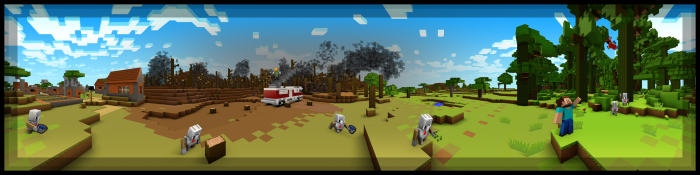
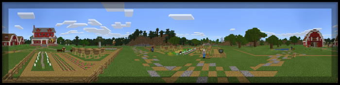
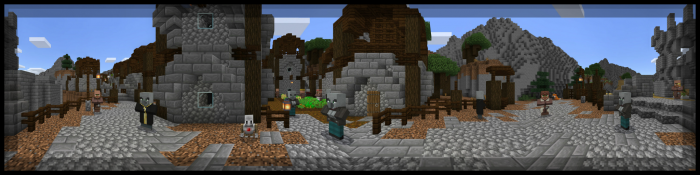
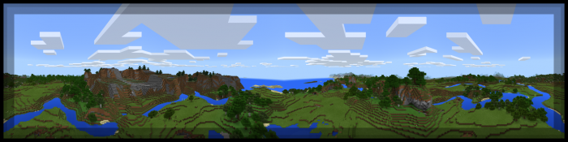
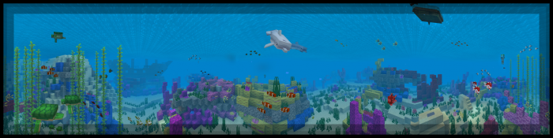
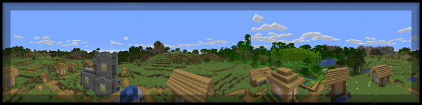
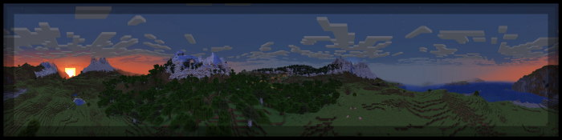

## PanoramaSwitcher 1.02
#### Panorama Switcher is a resource pack made for those interested in revisiting the older panoramas of Minecraft Bedrock, and even of other versions of Minecraft. We've done our absolute best to archive every panorama which was available in Bedrock, including the Halloween panorama from 2021! Panorama Switcher is possibly one of the first to feature it; and isn't it just so cool?
### Extra Functions
#### Since I'm not even close to being finished with all of the planned extra functionality, for now here's a little sneak peak into what's being worked on, though there is no confirmation that the old servers tab is going to be able to return in it's original form; although I'll try to keep it as close as possible.

### Included Panoramas

### Smaller Filesize
#### If you think a pack being over 80mb is a bit ridiculous, know that this is due to all panoramas being high resolution, but if you want to decrease the filesize with the compromise of panorama quality, consider downloading PanoramaSelectorSD, which is less than half the size of the base pack. Alternatively, I'll soon be splitting the pack by platform, which should reduce the filesize as well.

<i class="material-icons">insert_drive_file</i><a href="https://drive.google.com/uc?confirm=t&id=1iD69MtMooL_Y703c6q5qf34_L9CZon7b">PanoramaSwitcher.mcpack</a>

<i class="material-icons">insert_drive_file</i><a href="https://drive.google.com/uc?confirm=t&id=1RyceYW944J4RdMlLL1jqo63Mlm1MVo5V">PanoramaSwitcher.zip</a>

<i class="material-icons">insert_drive_file</i><a href="https://drive.google.com/uc?confirm=t&id=1yvXytmo7rdXGpwxntpgkAcOuQ7HZjd5A">PanoramaSwitcherSD.mcpack</a>

<i class="material-icons">insert_drive_file</i><a href="https://drive.google.com/uc?confirm=t&id=14Q76FggjU3IIIh5v7uzrLtacenv5f2rP">PanoramaSwitcherSD.zip</a>

<i class="material-icons">text_snippet</i><h3 id="changelog">Changelog</h3><h4>Fixed ‘Bussy Bees’ typo, it should now be Buzzy Bees.
</h4><h4>Added Education 1.14 panoramas.</h4><h4>Added title.png for some panoramas.</h4><h4>Also, sorry for the long time between releases, I hope to update more frequently in the future!</h4>

