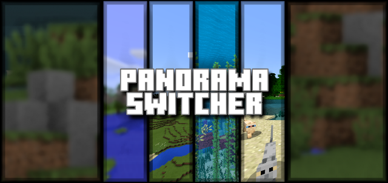
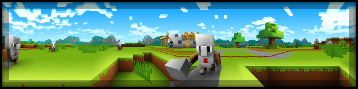
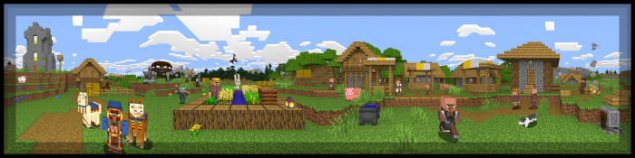

## PanoramaSwitcher

PanoramaSwitcher Version 1.03

<h4 style="margin-bottom:4px">Panorama Switcher is a resource pack made for those interested in revisiting the older panoramas of Minecraft Bedrock, and even of other versions of Minecraft. I’ve done my absolute best to gather every panorama which was available in Bedrock, and now I’ve decided to share it with all of you!</h4>

<i class="material-icons"></i><h3 id="some-included-panoramas">Some Included Panoramas</h3><i class="material-icons"></i>

<i class="material-icons"></i><h3 id="changelog">Changelog</h3><h4>Added Wild Update panorama as well as Preview and the 2022 Halloween panorama, perhaps before its active in Minecraft?</h4><h4>Removed PanoramaSwitcherSD, though might be added to the website again in the future.</h4>

<i class="material-icons"></i><h3 id="files">Files</h3><a href="https://github.com/Kee7702/Projects-Legacy/releases/download/77a01c5898698/PanoramaSwitcher.mcpack"><h4>PanoramaSwitcher.mcpack (96.4 MB)</h4></a><a href="https://github.com/Kee7702/Projects-Legacy/releases/download/77a01c5898698/PanoramaSwitcher.zip"><h4>PanoramaSwitcher.zip (96.4 MB)</h4></a>

