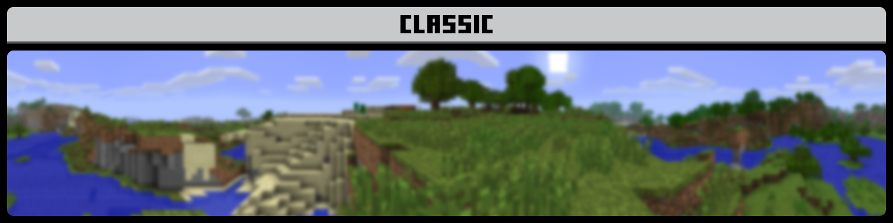

## PanoramaSwitcher

<h4 style="margin:0">Panorama Switcher Version 1.05</h4>
<h4 style="margin-bottom:4px">Panorama Switcher is a resource pack made for those interested in revisiting the older panoramas of Minecraft Bedrock, and even of other versions of Minecraft. I’ve done my absolute best to gather every panorama which was available in Bedrock, and now I’ve decided to share it with all of you!</h4>

<i class="material-icons">book</i><h3 id="education-edition-panoramas">Education Edition Panoramas</h3><i class="material-icons"></i>

<i class="material-icons">panorama</i><h3 id="bedrock-or-java-panoramas">Bedrock or Java Panoramas</h3><i class="material-icons"></i>

<i class="material-icons">videogame_asset</i><h3 id="console-edition-pamoramas">Console Edition Panoramas</h3><i class="material-icons"></i>

<i class="material-icons">text_snippet</i><h3 id="changelog">Changelog</h3><h4>File size reduction</h4>
<a class="home-content-container" style="border-radius:8px;background:#222d;padding:8px;color:#ccc;display:inline-block;margin:4px;line-height:24px;text-decoration:none">
PanoramaSwitcher.mcpack

No File
</a><a class="home-content-container" style="border-radius:8px;background:#222d;padding:8px;color:#ccc;display:inline-block;margin:4px;line-height:24px;text-decoration:none">
PanoramaSwitcher.zip

No File
</a><a class="home-content-container" style="border-radius:8px;background:#222d;padding:8px;color:#ccc;display:inline-block;margin:4px;line-height:24px;text-decoration:none">
PanoramaSwitcherCE.mcpack

No File
</a><a class="home-content-container" style="border-radius:8px;background:#222d;padding:8px;color:#ccc;display:inline-block;margin:4px;line-height:24px;text-decoration:none">
PanoramaSwitcherCE.zip

No File
</a>

