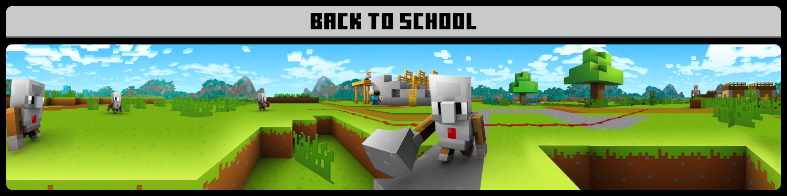
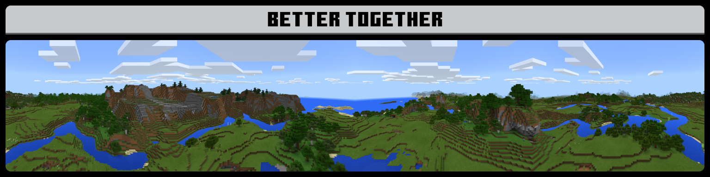

## PanoramaSwitcher 1.05

<a class="home-content-container" style="border-radius:8px;background: #222d;padding:8px;color:#ccc;display:inline-block;margin:4px;line-height: 24px;text-decoration: none;" href="https://drive.google.com/uc?confirm=t&amp;id=1eSEw_VHDFOiBq6jJKvHX-C_FhTG4vKMc">
PanoramaSwitcher.mcpack

95.2 MB
</a><a class="home-content-container" style="border-radius:8px;background: #222d;padding:8px;color:#ccc;display:inline-block;margin:4px;line-height: 24px;text-decoration: none;" href="https://drive.google.com/uc?confirm=t&amp;id=18Edb_tX1YGRonKZEUKjMm8OGhflr7_iE">
PanoramaSwitcher.zip

95.2 MB
</a><a class="home-content-container" style="border-radius:8px;background: #222d;padding:8px;color:#ccc;display:inline-block;margin:4px;line-height: 24px;text-decoration: none;" href="https://drive.google.com/uc?confirm=t&amp;id=1UEV8XKZQG__3UWUy1PgqOgWebHSLqfVD">
PanoramaSwitcherCapped.mcpack

70.5 MB
</a><a class="home-content-container" style="border-radius:8px;background: #222d;padding:8px;color:#ccc;display:inline-block;margin:4px;line-height: 24px;text-decoration: none;" href="https://drive.google.com/uc?confirm=t&amp;id=1Fa_8EpdZq-KqCSw1UKMwnMUWMMWnBoXY">
PanoramaSwitcherCapped.zip

70.5 MB
</a><a class="home-content-container" style="border-radius:8px;background: #222d;padding:8px;color:#ccc;display:inline-block;margin:4px;line-height: 24px;text-decoration: none;" href="https://drive.google.com/uc?confirm=t&amp;id=1RSfuZkSoeXlKZ-q6DUgOTPLZn35Lg1ER">
PanoramaSwitcherCE.mcpack

7.1 MB
</a><a class="home-content-container" style="border-radius:8px;background: #222d;padding:8px;color:#ccc;display:inline-block;margin:4px;line-height: 24px;text-decoration: none;" href="https://drive.google.com/uc?confirm=t&amp;id=15WEi7ahj43ivOcmgdSH29A6xaQpxkstM">
PanoramaSwitcherCE.zip

7.1 MB
</a>

<h4 style="margin-bottom: 4px;">Panorama Switcher is a resource pack made for those interested in revisiting the older panoramas of Minecraft Bedrock, and even of other versions of Minecraft. I’ve done my absolute best to gather every panorama which was available in Bedrock, and now I’ve decided to share it with all of you!</h4><i class="material-icons">text_snippet</i><h3 id="changelog">Changelog</h3><h4>Added all Education Edition panoramas, with their official or "dubbed" names included as well.</h4><h4>Removed 1.12 Education demo panorama.</h4><h4>The base PanoramaSwitcher pack has resolutions capped to 1024x, the standard for Minecraft panoramas.</h4><h4>A new 768x version is available, PanoramaSwitcher Capped.</h4><h4>Introducing PanoramaSwitcherCE, a panorama switcher for Console Edition panoramas, which requires Console Aspects or Project 4JD UI.</h4><i class="material-icons" style="margin-top: 8px;">panorama</i><h3 id="changelog" style="margin-top: 8px;">Panoramas</h3>

