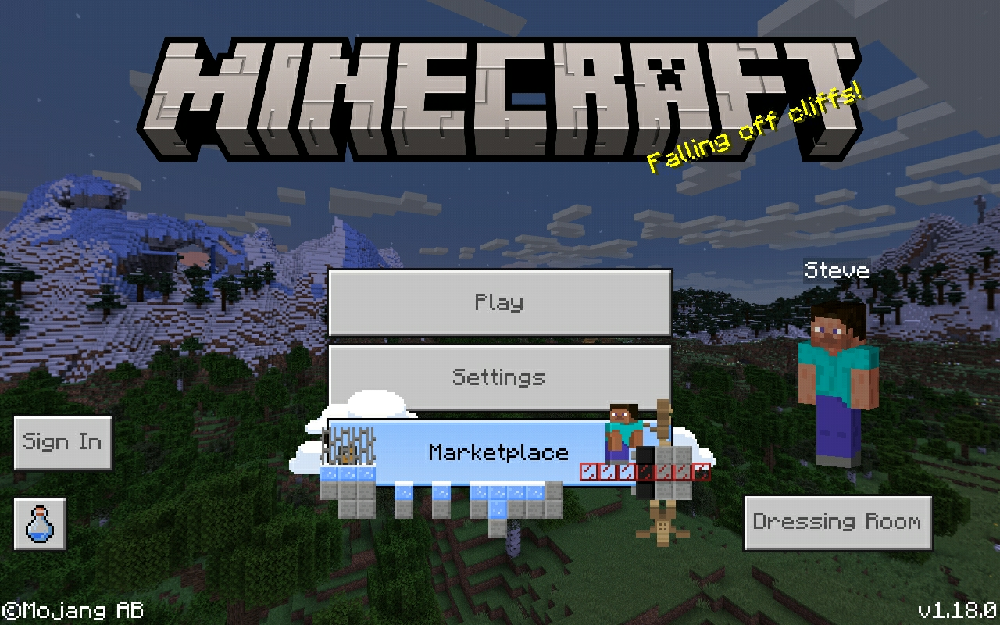
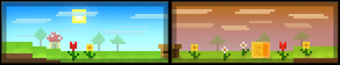

## StoreSwitcher
#### Store Switcher is a collection of several marketplace button advertisements, with the ability to switch between all of them, or use no advertisement at all. This pack also has a fix for legacy bedrock versions, allowing you to use this pack on any version which has subpack support.
### Beta Release
#### This pack is currently in beta; some buttons may not appear correctly on the certain versions.
### StoreSwitcher In Action
#### While I could sit here and explain in total detail what this pack does, I figured it'd be much easier to show you instead.

#### Disneyland

#### Lava Block Survival

#### Cloudtop Quest
### Included Buttons
#### **Buttons shown here are cropped to show the hover and default texture. Also, only the base button texture is shown, so no sprites are going to be visible from this preview.**

<i class="material-icons">insert_drive_file</i><a href="https://drive.google.com/uc?confirm=t&id=1uXi98CzEofzhxVJd9aRXiULh8H-Pn4-S">StoreSwitcher.mcpack</a>

<i class="material-icons">insert_drive_file</i><a href="https://drive.google.com/uc?confirm=t&id=109PH7cAPhMJ6oEke81SNdAaQQb-kxZnQ">StoreSwitcher.zip</a>

<i class="material-icons">insert_drive_file</i><a href="https://drive.google.com/uc?confirm=t&id=1AQYdCKBalrZEdRSevUeVgtSatI_JwI0x">LegacyFix.mcpack</a>

<i class="material-icons">insert_drive_file</i><a href="https://drive.google.com/uc?confirm=t&id=1Sd2lWZOyk0IbAvXHqdkif4sKEhUyUNZA">LegacyFix.zip</a>

<element>
<a href="/"><i class="material-icons navigate">first_page</i></a><a href="../"><i class="material-icons navigate">arrow_back</i></a>
</element>
<head></head>
