## StoreSwitcher

<i class="material-icons">update</i><h3>Blog Posts</h3><i class="material-icons"></i>

<a class="home-content-container" style="border-radius:8px;background: #222d;padding:8px;color:#ccc;display:inline-block;margin:4px;line-height: 24px;text-decoration: none;" href="/updates/storeswitcher-development-ended-nov1622">
StoreSwitcher Development Ended

November 16th, 2022
</a>

<a class="home-content-container" style="border-radius:8px;background: #222d;padding:8px;color:#ccc;display:inline-block;margin:4px;line-height: 24px;text-decoration: none;" href="https://drive.google.com/uc?confirm=t&amp;id=1lrhoBtsVFJQ2i-AEcnFsQ5IzL5qYKGFS">
StoreSwitcher.mcpack

743 KB
</a><a class="home-content-container" style="border-radius:8px;background: #222d;padding:8px;color:#ccc;display:inline-block;margin:4px;line-height: 24px;text-decoration: none;" href="https://drive.google.com/uc?confirm=t&amp;id=1vhwEVUISEz1qWk0jlREYQWvIl6RxErkv">
StoreSwitcher.zip

743 KB
</a><a class="home-content-container" style="border-radius:8px;background: #222d;padding:8px;color:#ccc;display:inline-block;margin:4px;line-height: 24px;text-decoration: none;" href="https://drive.google.com/uc?confirm=t&amp;id=1IVAPW5JtmIzLRDDRzIXva7WnbFCwu19O">
LegacyFix.mcpack

60 KB
</a><a class="home-content-container" style="border-radius:8px;background: #222d;padding:8px;color:#ccc;display:inline-block;margin:4px;line-height: 24px;text-decoration: none;" href="https://drive.google.com/uc?confirm=t&amp;id=1RruNNL2r-GCpbNYQYxuOeCp_Y3oigLnn">
LegacyFix.zip

60 KB
</a>

<h4 style="margin-bottom: 4px;">Store Switcher is a collection of several marketplace button advertisements, with the ability to switch between all of them, or use no advertisement at all. This pack also has a fix for legacy bedrock versions, allowing you to use this pack on any version which has subpack support.</h4><i class="material-icons" style="margin-top: 8px;">visibility</i><h3 id="extra-functions" style="margin-top: 8px;">StoreSwitcher In Action</h3><a class="home-content-image" style="width:auto">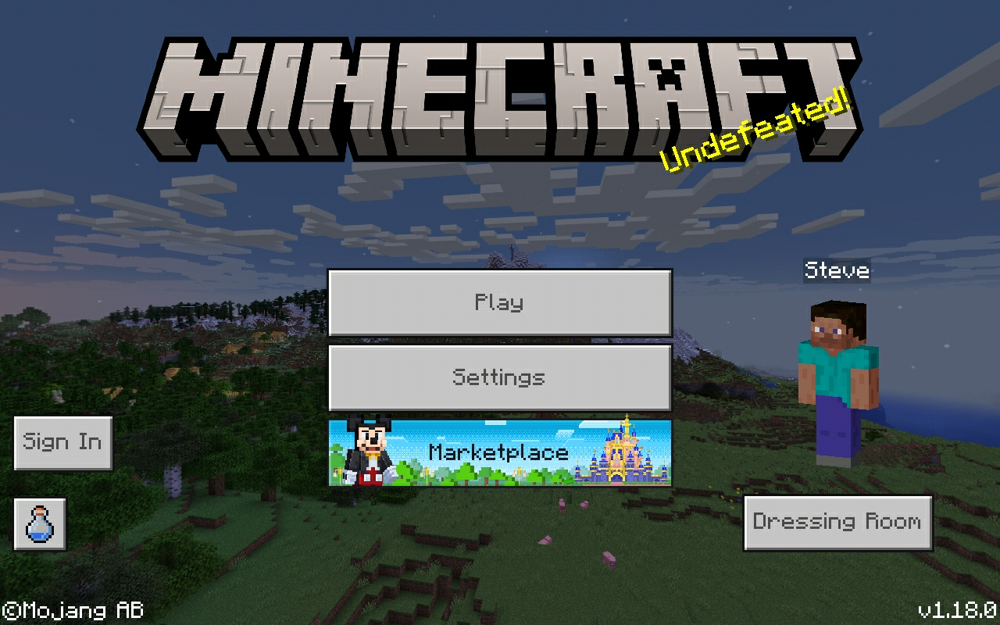
Disneyland Button
</a><a class="home-content-image" style="width:auto">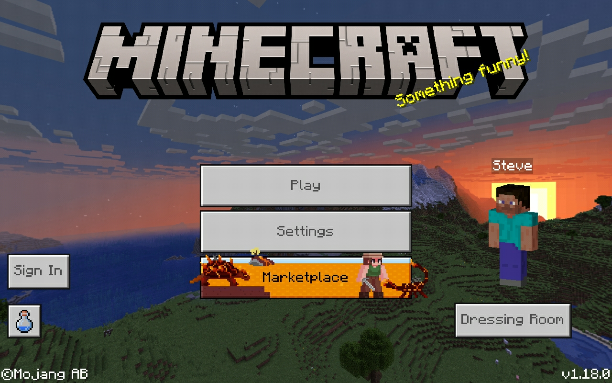
Lava Block Survival
</a><a class="home-content-image" style="width:auto">
Cloudtop Quest
</a><i class="material-icons" style="margin-top: 8px;">tune</i><h3 id="included-buttons" style="margin-top: 8px;">Included Buttons</h3>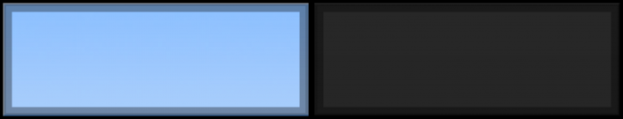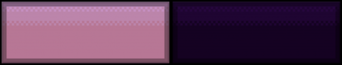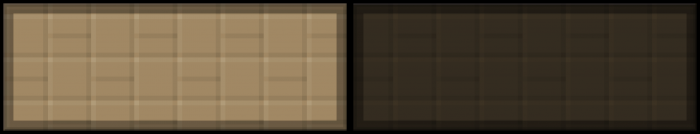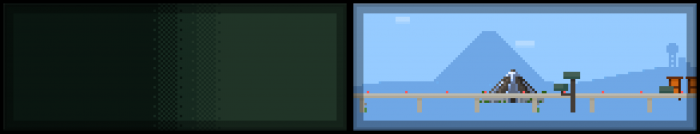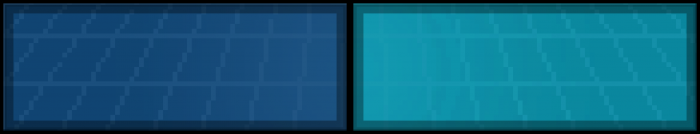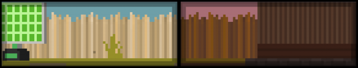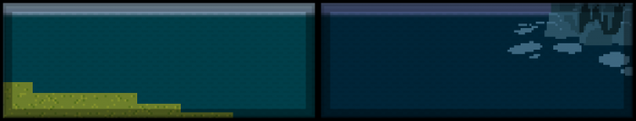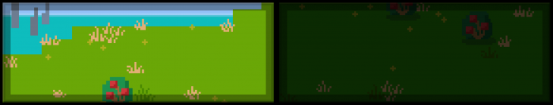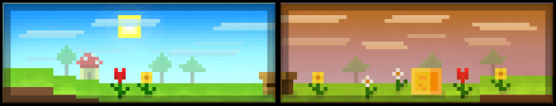

